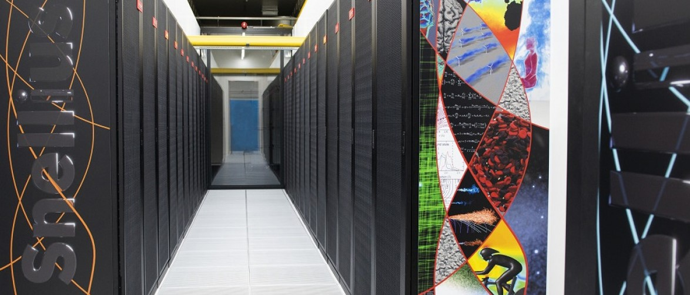

# Course Description
The purpose of this 1-day workshop is to teach participants how to use the new parallel capabilities in MODFLOW 6. The course will provide an overview of the MODFLOW program, the Python tools available for pre- and post-processing simulations, and the concepts for parallel computing with MODFLOW. It will include hands-on exercises to run example problems in parallel on a laptop computer. The used software and techniques are scalable and are intended to be applied on large-scale HPC infrastructures.

# Getting Started
Windows Subsystem for Linux (WSL) is a straight forward way for Windows users to get started using the parallel version of MODFLOW. Instructions for setting up WSL and compiling the parallel version of MODFLOW is provided in [wsl_setup.md](./wsl_setup.md).

If you are using the MacOS or Linux operating system you can follow the instructions in [wsl_setup.md](./wsl_setup.md) starting at the [Clone the class repo](./wsl_setup.md#Clone-the-class-repo).

# Agenda
* Welcome and Introductions
* Overview of MODFLOW 6 and FloPy
* Hands-on exercise I: setup a FloPy model and run
* == BREAK
* Hands-on exercise I: postprocess and partition a model
* Hands-on exercise I: running parallel MODFLOW 6
* == LUNCH ==
* Parallel MODFLOW 6: context and applications
* Hands-on exercise II: build and partition the watershed
* == BREAK ==
* Hands-on exercise II: validate results and parallel performance
* (Hands-on alternative: run your own model in parallel)
* Discussion and Wrap up
